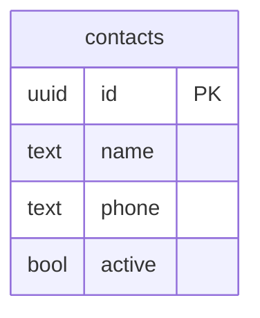

# whatsapp-notifier

Script Python que lê contatos cadastrados no Supabase e envia mensagens personalizadas via WhatsApp usando a Z-API.

```
2025-01-15 14:23:01 [INFO] Iniciando whatsapp-notifier...
2025-01-15 14:23:02 [INFO] 3 contato(s) encontrado(s) no banco
2025-01-15 14:23:03 [INFO] Mensagem enviada para 5511999990001
2025-01-15 14:23:04 [INFO] Mensagem enviada para 5511999990002
2025-01-15 14:23:05 [INFO] Mensagem enviada para 5511999990003
2025-01-15 14:23:05 [INFO] Sumário: 3/3 mensagens enviadas com sucesso
```

---

## Pré-requisitos

- Python 3.12+ **ou** Docker
- Conta no [Supabase](https://supabase.com) (plano gratuito)
- Conta na [Z-API](https://z-api.io) com uma instância conectada (plano gratuito)

---

## 1. Setup do banco de dados (Supabase)

### 1.1 Estrutura da tabela
 

 
> O campo `phone` deve conter apenas números no formato internacional brasileiro.
> Exemplo: `5511999990001` (55 = Brasil, 11 = DDD, 9 dígitos do número).
 
### 1.2 Criar a tabela
 
No painel do Supabase, acesse **SQL Editor** e execute:
 
```sql
create table contacts (
  id     uuid primary key default gen_random_uuid(),
  name   text not null,
  phone  text not null,
  active bool not null default true
);
```
 
### 1.3 Inserir contatos de teste

```sql
insert into contacts (name, phone) values
  ('João',   '5511999990001'),
  ('Maria',  '5511999990002'),
  ('Carlos', '5511999990003');
```
---

## 2. Variáveis de ambiente

Copie o arquivo de exemplo e preencha com suas credenciais:

```bash
cp .env.example .env
```

Conteúdo do `.env`:

```env
SUPABASE_URL=https://xxxx.supabase.co
SUPABASE_KEY=eyJ...

ZAPI_INSTANCE=seu-instance-id
ZAPI_TOKEN=seu-instance-token
ZAPI_CLIENT_TOKEN=seu-client-token
```

### Como obter cada variável

**`SUPABASE_URL` e `SUPABASE_KEY`**

No painel do Supabase:
1. Acesse **Project Settings → API**
2. Copie a **Project URL** → `SUPABASE_URL`
3. Copie a **anon public key** → `SUPABASE_KEY`

**`ZAPI_INSTANCE` e `ZAPI_TOKEN`**

No painel da Z-API:
1. Acesse sua instância (o número de WhatsApp conectado)
2. Copie o **Instance ID** → `ZAPI_INSTANCE`
3. Copie o **Token** → `ZAPI_TOKEN`

**`ZAPI_CLIENT_TOKEN`**

No painel da Z-API:
1. Acesse **Account → Security**
2. Copie o **Client Token** → `ZAPI_CLIENT_TOKEN`

> O `Client-Token` é um token da sua conta, não da instância.
> Ele é enviado como header de segurança em todas as requisições.

---

## 3. Instalação e execução

### Opção A — Python local

```bash
# 1. Criar e ativar ambiente virtual
python -m venv .venv
source .venv/bin/activate      # Linux/macOS
.venv\Scripts\activate         # Windows

# 2. Instalar dependências
pip install -r requirements.txt

# 3. Rodar
python main.py
```

### Opção B — Docker

```bash
# Build e execução em um comando
docker compose up --build

# Ou separado
docker build -t whatsapp-notifier .
docker run --env-file .env whatsapp-notifier
```

---

## 4. Estrutura do projeto

```
whatsapp-notifier/
├── .env                  # Credenciais (não commitado)
├── .env.example          # Template das variáveis
├── .gitignore
├── .dockerignore
├── Dockerfile
├── docker-compose.yml
├── requirements.txt
├── main.py               # Ponto de entrada
└── src/
    ├── __init__.py
    ├── config.py         # Carrega e valida variáveis de ambiente
    ├── logger.py         # Configuração de logs
    ├── database.py       # Busca contatos no Supabase
    └── zapi_client.py    # Envia mensagens via Z-API
```

---

## 5. Comportamento esperado

- Busca contatos com `active = true` no banco
- Envia a mensagem `"Olá, {nome} tudo bem com você?"` para cada um
- Se um envio falhar, registra o erro e **continua** para o próximo contato
- Ao final, exibe um sumário com total de sucessos e falhas
- Se faltar qualquer variável de ambiente, encerra imediatamente com mensagem clara

---

## 6. Dependências

| Pacote | Versão | Uso |
|---|---|---|
| `supabase` | 2.31.0 | Cliente oficial do Supabase |
| `requests` | 2.34.2 | Requisições HTTP para a Z-API |
| `python-dotenv` | 1.2.2 | Carregamento do arquivo `.env` |